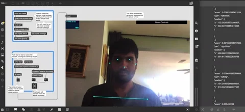
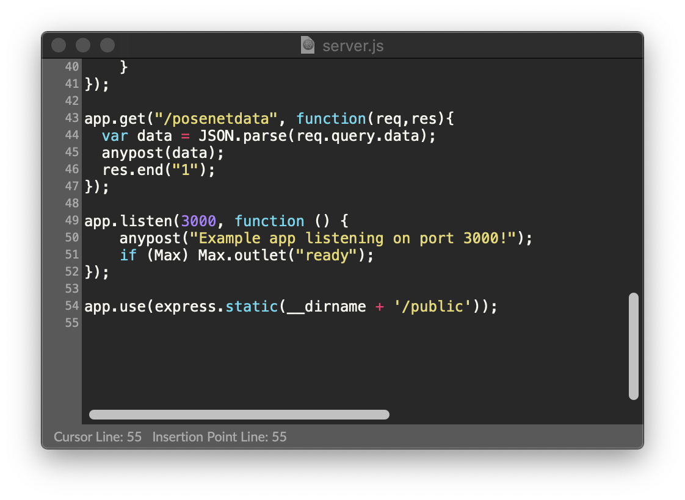

# posenet-node-max

## Usage
Open `/express/express.maxproj`
Click on `script start` button.

( You may need to install dependencies one time by clicking `script npm install` button ) 

## Using PoseNet data
Edit `/express/express-node/server.js`

Poses are available in `data` variable.

## PS (Windows 10)
For better performance, the MaxHelper process (maxhelper.exe in windows 10) should be assigned to the dedicated GPU instead of integrated (default) one.
